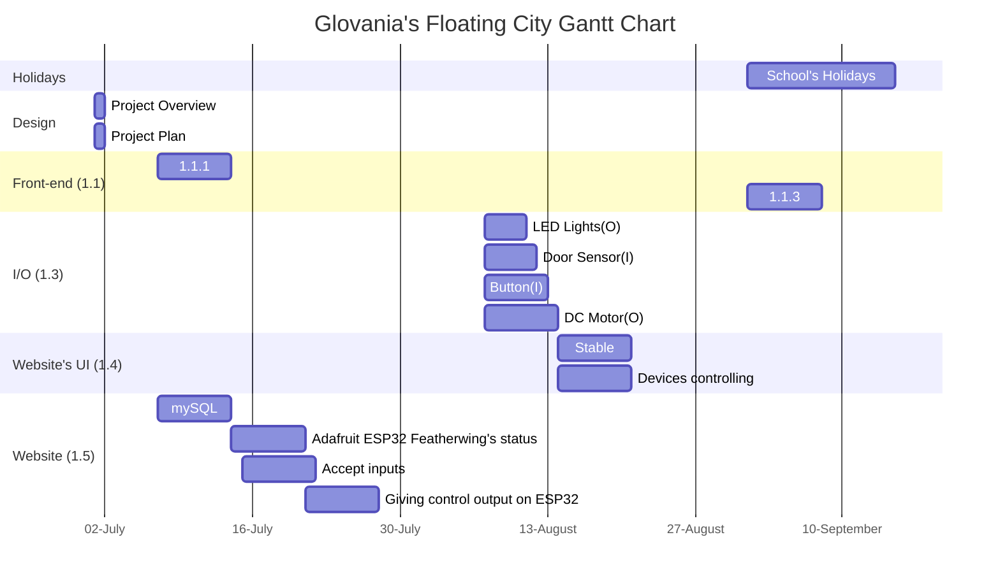

```mermaid
gantt
    title Glovania's Floating City Gantt Chart
    dateFormat DD-MM-YYYY
    axisFormat %d-%B
    tickInterval 2week


    section Holidays
    School's Holidays: 01-09-2023, 14d


    section Design
    Project Overview: 01-07-2023, 1d
    Project Plan: 01-07-2023, 1d


    section Front-end (1.1)
    1.1.1: 07-07-2023, 7d
    1.1.3: 01-09-2023, 7d

    section Back-end (1.2)


    section I/O (1.3)
    LED Lights(O): 07-08-2023, 4d
    Door Sensor(I): 07-08-2023, 5d
    Button(I): 07-08-2023, 6d
    DC Motor(O): 07-08-2023, 7d


    section Website's UI (1.4)
    Stable: 14-08-2023, 7d
    Devices controlling: 14-08-2023, 7d
    

    section Website (1.5)
    mySQL: 07-07-2023, 7d
    Adafruit ESP32 Featherwing's status: 14-07-2023, 7d
    Accept inputs: 15-07-2023, 7d
    Giving control output on ESP32: 21-07-2023, 7d
```